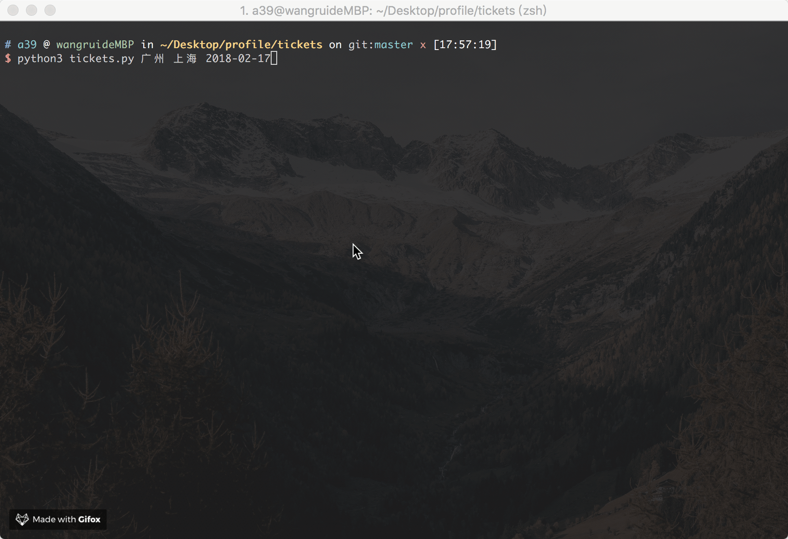

# train-ticket

> python3 查询火车票
> 本来想爬12306的票的，不小心进了山寨网站 12306.com，那不管了，就爬你的了

## preview


## run

``` bash
Train tickets query via command-line

Usage: tickets [-gdctkz] <from> <to> <date>

Options:
  -h, --help        显示帮助菜单
  -g                高铁
  -c                城际
  -d                动车
  -t                特快
  -k                快速
  -z                直达

Example:
  python3 tickets 南京 北京 2016-07-01
  python3 tickets -dg 南京 北京 2016-07-01

```